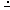

Shoot the Things
===
# Installation #
As of this moment, the game is unable to be installed, but will be available for installation soon.

# Game Overview #
The game's objective is to move your charcter, `Player`, around the map, shooting the things that spawn at multiple locations around the map. The things that spawn will deduct one health from your player upon contact, and subsequently disappear, having served their purpose. 
# Controls #
To move `Player`:  WASD

To shoot `Bullet`: Left mouse button

# Sprites #
`Player`:  

`Bullet`:  

`DangerousThing`: 

